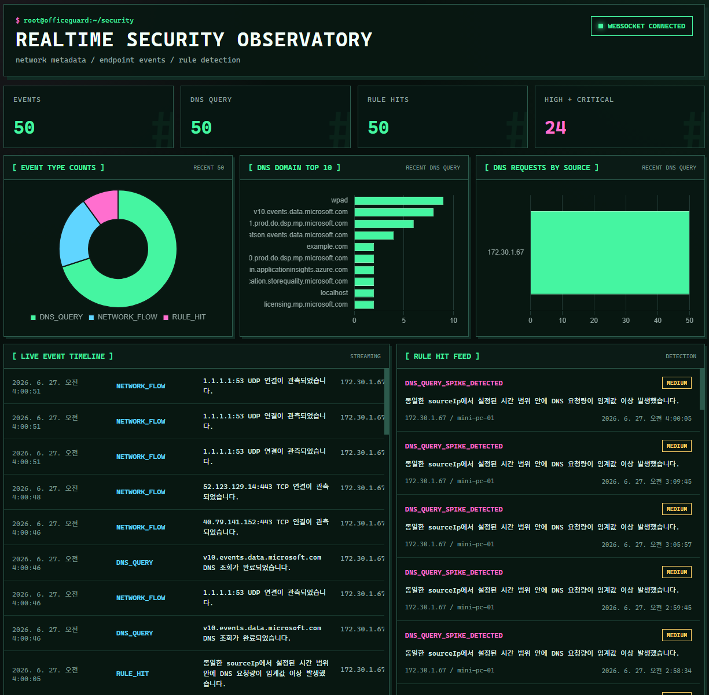
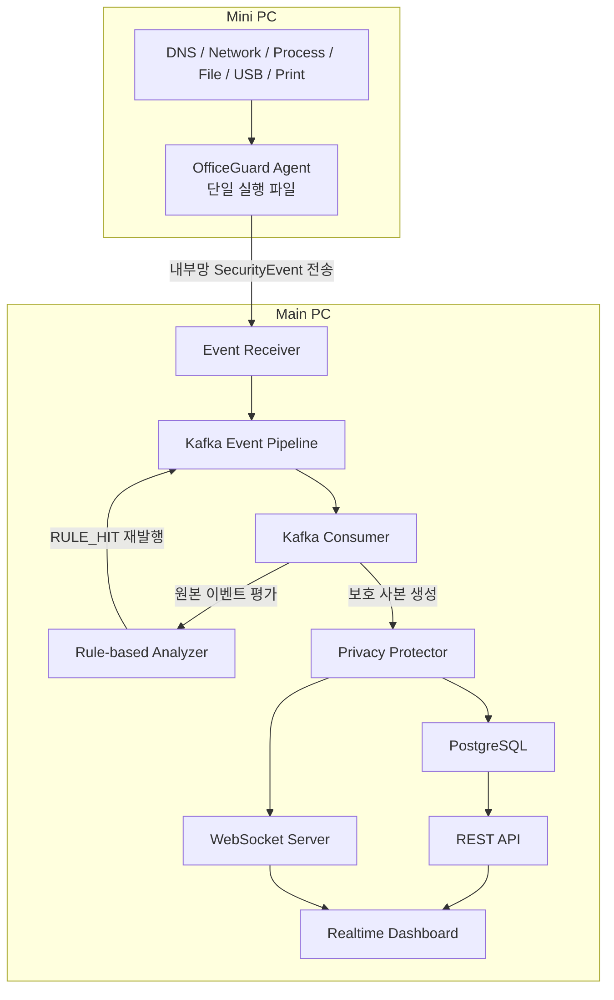

# OfficeGuard Lab

> Main PC에 보안 관측 서버를 구성하고, Mini PC의 네트워크 및 단말 이벤트를 단일 Agent 실행 파일로 수집·분석하는 홈랩 프로젝트

[🌐 **프로젝트 정리 HTML**](https://seoheejung.github.io/officeguard-lab/)

## 프로젝트 개요

**OfficeGuard Lab**은 Mini PC에서 발생한 DNS, Network Flow, Process, File, USB, Print Event를 수집하고 Main PC에서 저장·분석·시각화하는 보안 관측 프로젝트다.

Mini PC에서는 설치 과정이 없는 `officeguard-agent.exe`를 직접 실행한다. Agent가 수집한 이벤트는 공통 `SecurityEvent`로 변환된 후 내부망을 통해 Main PC Event Receiver로 전달된다.

Main PC에서는 Kafka 기반 Event Pipeline, Rule-based Analyzer, PostgreSQL, REST API, WebSocket, Realtime Dashboard를 실행한다.

허가된 홈랩 환경에서의 보안 이벤트 수집 구조 학습 목적이며, 상용 EDR 또는 DLP 구현 목적은 아니다.



---

## 프로젝트 목표

* Main PC 기반 중앙 보안 관측 환경 구성
* Mini PC 실제 이벤트 수집
* 단일 실행 파일 형태의 Agent 구성
* 공통 `SecurityEvent` 모델 기반 이벤트 정규화
* Kafka 기반 비동기 Event Pipeline 구성
* Rule 기반 이상 행위 탐지
* PostgreSQL 기반 이벤트 저장 및 조회
* WebSocket 기반 실시간 이벤트 전달
* Charm 스타일 터미널 관제 UI 구성
* Source IP 및 민감 도메인 보호
* 이벤트 보관 기간 및 조회 접근 로그 적용

---

## 주요 기능

### Mini PC Agent

* 설치 과정 없는 단일 실행 파일 기반 Agent
* 사용자 직접 실행 및 `Ctrl+C` 종료
* DNS, Network Flow, Process, File, USB, Print Event 수집
* 수집 데이터를 공통 `SecurityEvent`로 정규화
* 내부망을 통한 Main PC Event Receiver 전송

### Main PC Event Pipeline

* Event Receiver 기반 수신 데이터 검증
* 유효한 `SecurityEvent`의 Kafka Topic 발행
* Kafka Producer·Consumer 기반 비동기 이벤트 처리
* 원본 이벤트와 Privacy 보호 사본의 처리 흐름 분리

### Rule-based Analyzer

* 대용량 파일 복사 탐지
* USB 연결 후 파일 복사 탐지
* 파일 복사 후 외부 대상 도메인 조회 탐지
* 동일 Source IP의 DNS 요청량 급증 탐지
* 조건 충족 시 별도 `RULE_HIT` 생성 및 Kafka 재발행

### Storage 및 조회 API

* PostgreSQL 기반 `SecurityEvent` 및 `RULE_HIT` 저장
* `eventId` 기준 중복 저장 방지
* 이벤트 타입, Source IP, Device ID, 시간 범위 조회
* Severity 및 Rule ID 기준 Rule Hit 조회

```text
GET /api/events
GET /api/events/:eventId
GET /api/rule-hits
```

### WebSocket 및 Realtime Dashboard

* REST API 기반 최근 이벤트 초기 조회
* WebSocket 기반 신규 이벤트 실시간 전달
* REST와 WebSocket 이벤트의 `eventId` 기준 병합
* Charm 스타일 터미널 관제 UI
* 이벤트 타임라인, DNS 통계, Rule Hit 현황 표시

### Privacy & Data Protection

* HMAC-SHA256 기반 Source IP 익명화
* 민감 도메인과 하위 도메인 마스킹
* 마스킹 전 원본 이벤트 기반 Analyzer 평가
* 보호 사본 기반 PostgreSQL 저장 및 Dashboard 전달
* `stored_at` 기준 이벤트 보관 기간 적용
* 조회 API 접근 로그 최소 기록

---

## 시스템 구조



---

## 이벤트 처리 흐름

```text
Mini PC 실제 행위
→ Mini PC Agent 수집
→ SecurityEvent 생성
→ HTTP 내부망 전송
→ Main PC Event Receiver
→ 이벤트 구조 검증
→ Kafka Topic 발행
→ Kafka Consumer 수신
   ├─ 원본 이벤트 Rule-based Analyzer 평가
   │  └─ 조건 충족 시 RULE_HIT 재발행
   │
   └─ 보호 사본 생성
      ├─ Source IP 익명화
      └─ 민감 도메인 마스킹
         ├─ PostgreSQL 저장
         └─ WebSocket 전달
→ Realtime Dashboard
```

---

## 기술 스택

| 구분 | 기술 |
| --- | --- |
| Backend | Node.js, TypeScript, Express, WebSocket |
| Event Pipeline | Apache Kafka, KafkaJS, KRaft |
| Storage | PostgreSQL, JSONB, node-postgres (`pg`) |
| Infra | Docker, Docker Compose, Main PC, Mini PC, WSL2 Ubuntu |
| Dashboard | React, TypeScript, Vite, Chart.js, WebSocket, Charm 스타일 터미널 관제 UI |

---

## 환경 변수

Main PC 설정은 `infra/.env`, Mini PC Agent 설정은 실행 파일과 같은 디렉터리의 `.env`를 사용한다.

실제 IP, 비밀번호, 익명화 Key, 민감 도메인 목록은 Git에 포함하지 않는다.

### Main PC

| 환경 변수 | 역할 |
| --- | --- |
| `NODE_ENV` | 애플리케이션 실행 환경 |
| `PORT` | Express 서버 포트 |
| `KAFKA_CLIENT_ID` | Kafka Client 식별자 |
| `KAFKA_BROKERS` | 로컬 Backend용 Kafka 주소 |
| `KAFKA_DOCKER_BROKERS` | Docker Backend용 Kafka 주소 |
| `KAFKA_SECURITY_EVENTS_TOPIC` | SecurityEvent Topic |
| `KAFKA_CONSUMER_GROUP_ID` | Consumer Group 식별자 |
| `ANALYZER_LARGE_FILE_COPY_BYTES_THRESHOLD` | 대용량 파일 복사 탐지 기준 byte 수 |
| `ANALYZER_USB_FILE_COPY_WINDOW_SECONDS` | USB 연결 후 파일 복사 탐지 시간 |
| `ANALYZER_FILE_COPY_EXTERNAL_DOMAIN_WINDOW_SECONDS` | 파일 복사 후 외부 도메인 조회 탐지 시간 |
| `ANALYZER_DNS_SPIKE_WINDOW_SECONDS` | DNS 요청량 집계 시간 |
| `ANALYZER_DNS_SPIKE_THRESHOLD` | DNS 요청량 급증 탐지 기준 |
| `ANALYZER_EXTERNAL_DOMAINS` | 외부 전송 대상 도메인 목록 |
| `POSTGRES_HOST` | 로컬 Backend용 PostgreSQL Host |
| `POSTGRES_DOCKER_HOST` | Docker Backend용 PostgreSQL Host |
| `POSTGRES_PORT` | PostgreSQL 포트 |
| `POSTGRES_DB` | PostgreSQL Database 이름 |
| `POSTGRES_USER` | PostgreSQL 사용자 |
| `POSTGRES_PASSWORD` | PostgreSQL 비밀번호 |
| `DASHBOARD_PORT` | Dashboard Vite 서버 포트 |
| `DASHBOARD_BACKEND_URL` | 로컬 Dashboard용 Backend 주소 |
| `DASHBOARD_DOCKER_BACKEND_URL` | Docker Dashboard용 Backend 주소 |
| `PRIVACY_SOURCE_IP_ANONYMIZATION_ENABLED` | Source IP 익명화 활성화 여부 |
| `PRIVACY_SOURCE_IP_ANONYMIZATION_KEY` | HMAC-SHA256 익명화 Key |
| `PRIVACY_DOMAIN_MASKING_ENABLED` | 민감 도메인 마스킹 활성화 여부 |
| `PRIVACY_SENSITIVE_DOMAINS` | 쉼표 구분 민감 도메인 목록 |
| `PRIVACY_EVENT_RETENTION_DAYS` | 이벤트 보관 일수 |
| `PRIVACY_RETENTION_CLEANUP_INTERVAL_MS` | 만료 이벤트 정리 실행 주기 |

### Mini PC Agent

Mini PC Agent는 실행 파일과 같은 디렉터리의 `.env`를 사용한다.

| 환경 변수 | 역할   |
| --------- | ---------- |
| `AGENT_RECEIVER_URL` | Main PC Event Receiver 전체 URL |
| `AGENT_DEVICE_ID`  | Mini PC 식별자 |
| `AGENT_USER_ALIAS` | 선택 사용자 별칭 |
| `AGENT_NETWORK_INTERFACE` | Mini PC 내부 IPv4 조회 대상 Interface |
| `AGENT_REQUEST_TIMEOUT_MS` | Event Receiver 요청 제한 시간 |
| `AGENT_FILE_WATCH_PATH` | 일반 파일 이벤트 감시 경로 |
| `AGENT_FILE_EVENT_DEBOUNCE_MS` | 동일 파일 이벤트 중복 제한 시간 |
| `AGENT_USB_COPY_SETTLE_INTERVAL_MS` | USB 대상 파일 상태 재확인 간격 |
| `AGENT_USB_COPY_SETTLE_MAX_ATTEMPTS` | USB 대상 파일 상태 최대 확인 횟수 |

---

## 진행 단계

| Phase | 단계 | 주요 구현 내용 | 상태 |
| --- | --- | --- | --- |
| 1 | 프로젝트 초기 구성 | Node.js·TypeScript·Express 구성<br>환경 변수 분리<br>Docker Compose 및 Health Check 구성 | 완료 |
| 2 | 이벤트 모델 정의 | 공통 `SecurityEvent` 타입 정의<br>Network·Endpoint·Analyzer Event 분류<br>이벤트별 `metadata` 타입 구성 | 완료 |
| 3 | Mock Event Generator | DNS·USB·파일 복사 Mock Event 생성<br>UUID 및 Timestamp 생성<br>정상·의심 이벤트 반복 출력 | 완료 |
| 4 | Event Pipeline | Kafka KRaft Broker 구성<br>SecurityEvent Topic 및 Producer·Consumer 구현<br>로컬·Docker 실행 흐름 검증 | 완료 |
| 5 | Rule-based Analyzer | 대용량 파일 복사 탐지<br>파일 복사와 DNS 요청 연계 탐지<br>DNS 요청량 급증 탐지<br>`RULE_HIT` 생성 및 재발행 | 완료 |
| 6 | Storage | PostgreSQL `security_events` 저장<br>`eventId` 기준 중복 방지<br>이벤트 및 Rule Hit 조회 API 구현 | 완료 |
| 7 | WebSocket & Realtime Dashboard | WebSocket 실시간 이벤트 전달<br>REST API 초기 데이터 조회<br>React 기반 Charm 스타일 관제 Dashboard 구성 | 완료 |
| 8 | Mini PC Agent 기본 구성 및 DNS Event 연동 | Node.js SEA 기반 단일 실행 파일 구성<br>Windows DNS Event ID `3008` 수집<br>내부망 Event Receiver 전송 및 전체 Pipeline 연동 | 완료 |
| 9 | Mini PC Agent Network Flow 수집 | Windows Filtering Platform Event ID `5156` 수집<br>TCP·UDP 연결 Metadata 정규화<br>Agent Receiver 연결 Event 제외 | 완료 |
| 10 | Mini PC Agent Endpoint Event 수집 | Process·File·USB·Print Event 수집<br>USB 대상 파일 복사 감지<br>Mock Event Generator 제거<br>메일 첨부 전송 기능 구현·검증 제외 | 완료 |
| 11 | Privacy & Data Protection | HMAC-SHA256 기반 Source IP 익명화<br>민감 도메인 마스킹<br>이벤트 보관 기간 및 조회 API 접근 로그 적용 | 완료 |
| 12 | 문서화 및 시연 | 시스템 구조와 컴포넌트별 상세 문서 작성<br>실행·검증·시연 절차 정리<br>README 및 Dashboard 실행 화면 정리 | 완료 |

---

## 상세 문서

| 문서 | 내용 |
| --- | --- |
| [시스템 구조](docs/architecture.md) | 전체 시스템 구성, Kafka Pipeline, Main PC와 Mini PC 역할, 내부망 경계 |
| [이벤트 모델](docs/event-model.md) | 공통 `SecurityEvent` 필드, 이벤트 타입, 이벤트별 Metadata |
| [Main PC Event Receiver](docs/event-receiver.md) | Agent Event 수신 Endpoint, Validator, HTTP 응답, 책임 범위 |
| [Mini PC Agent](docs/agent.md) | Agent 빌드, Mini PC 배치 및 실행, Collector 설정과 이벤트 확인 |
| [Rule-based Analyzer](docs/rules.md) | 탐지 Rule, Severity, `RULE_HIT` 생성, Analyzer 상태 관리 |
| [Storage 및 조회 API](docs/storage-api.md) | PostgreSQL 저장 구조, REST API, 조회 조건과 보관 기간 |
| [WebSocket](docs/websocket.md) | WebSocket Endpoint, 메시지 구조, 실시간 전달 기준 |
| [Realtime Dashboard](docs/dashboard.md) | Charm 스타일 관제 UI, 데이터 흐름, 화면 구성, 실행 화면 |
| [보안 및 Privacy Boundary](docs/privacy.md) | 사용 범위, 수집 경계, Source IP 익명화, 도메인 마스킹, 보관 정책 |
| [실행 방법](docs/execution.md) | Main PC 환경 변수, 로컬·Docker 실행, Mini PC Agent 실행, 로그 확인 및 종료 |
| [시연 실행 스크립트](docs/demo.md) | DNS, USB 파일 복사, DNS Spike, Network Flow 시연 절차와 Main PC·Mini PC BAT 파일 활용 |

---

---

## 디렉터리 구조

```text
officeguard-lab/
├─ backend/
│  ├─ src/
│  │  ├─ analyzer/
│  │  ├─ config/
│  │  ├─ events/
│  │  ├─ middleware/
│  │  ├─ pipeline/
│  │  ├─ privacy/
│  │  ├─ receiver/
│  │  ├─ routes/
│  │  ├─ storage/
│  │  ├─ websocket/
│  │  └─ index.ts
│  ├─ Dockerfile
│  ├─ package.json
│  ├─ pnpm-lock.yaml
│  └─ tsconfig.json
│
├─ agent/
│  ├─ src/
│  │  ├─ collectors/
│  │  ├─ config/
│  │  ├─ events/
│  │  ├─ files/
│  │  ├─ network/
│  │  ├─ sender/
│  │  └─ index.ts
│  ├─ .env.example
│  ├─ package.json
│  ├─ pnpm-lock.yaml
│  ├─ sea-config.json
│  └─ tsconfig.json
│
├─ dashboard/
│  ├─ src/
│  │  ├─ hooks/
│  │  ├─ types/
│  │  ├─ App.tsx
│  │  ├─ main.tsx
│  │  ├─ styles.css
│  │  └─ vite-env.ts
│  ├─ Dockerfile
│  ├─ index.html
│  ├─ package.json
│  ├─ pnpm-lock.yaml
│  ├─ tsconfig.json
│  └─ vite.config.ts
│
├─ infra/
│  ├─ postgres/
│  │  └─ init/
│  ├─ .env.example
│  └─ docker-compose.yml
│
├─ scripts/
│  ├─ main-pc-demo.bat
│  └─ mini-pc-demo.bat
│
├─ docs/
│  ├─ image/
│  │  └─ dashboard.png
│  ├─ agent.md
│  ├─ architecture.md
│  ├─ dashboard.md
│  ├─ demo.md
│  ├─ event-model.md
│  ├─ event-receiver.md
│  ├─ execution.md
│  ├─ privacy.md
│  ├─ rules.md
│  ├─ storage-api.md
│  └─ websocket.md
│
└─ README.md
```

---

## Git Workflow

이 프로젝트는 기능 단위 브랜치와 PR 기반으로 변경 사항을 관리한다.

```bash
git checkout -b feature/xxx
git add .
git commit -m "feat: xxx"
git push origin feature/xxx
```

### 기준

* `main` 브랜치는 실행 가능한 상태로 유지한다.
* 기능 추가, 구조 변경, 문서 수정은 별도 브랜치에서 진행한다.
* PR 체크리스트 기반으로 변경 범위를 검증한다.
* 런타임 파일, 로그 파일, 로컬 설정 파일은 Git에 포함하지 않는다.
* 민감 정보, Token, 인증 정보, 개인 데이터는 저장소에 포함하지 않는다.

---

## 프로젝트 범위와 제외 범위

### 포함 범위

* 본인이 관리하는 Main PC와 Mini PC
* 허가된 홈랩 내부망
* DNS 및 Network Flow Metadata
* Process, File, USB, Print Event
* Kafka 기반 Event Pipeline
* Rule 기반 탐지
* PostgreSQL 저장 및 REST API 조회
* WebSocket 및 Realtime Dashboard
* Source IP 익명화와 민감 도메인 마스킹

### 제외 범위

* 타인 단말 및 타인 네트워크 대상 사용
* 실제 회사망 대상 사용
* Mini PC 트래픽의 Main PC 강제 우회
* Main PC DNS 서버 구성
* 외부 클라우드 Event 전송
* 패킷 Payload 수집
* HTTPS 본문 수집 및 복호화
* 비밀번호, Cookie, 인증 Token 수집
* 파일 본문, 키보드 입력, 화면 캡처 수집
* Agent 설치 프로그램
* Windows Service 등록
* Agent 자동 시작 및 은닉 실행
* Agent 제거 방지
* Kernel Driver 및 File System Minifilter
* 상용 EDR 또는 DLP 기능

