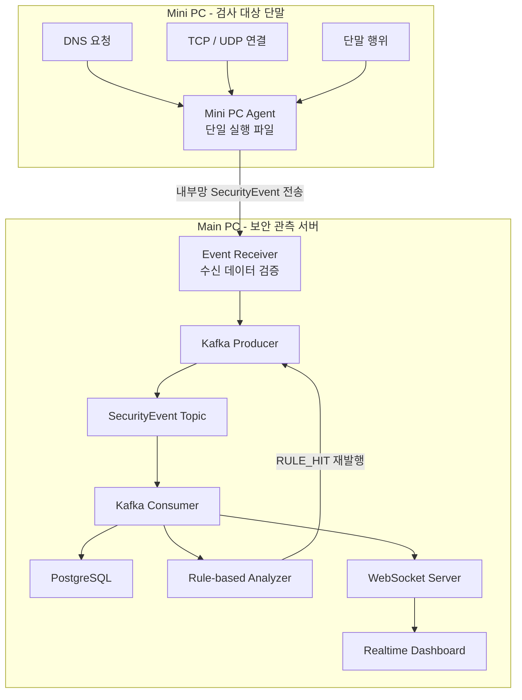

# OfficeGuard Lab

> Main PC에 보안 관측 서버를 구성하고, Mini PC에서 단일 Agent 실행 파일로 수집한 네트워크 및 단말 이벤트를 실시간으로 저장·분석하는 학습용 프로젝트

## 개요

**OfficeGuard Lab**은 허가된 홈랩 환경에서 검사 대상 Mini PC의 네트워크 메타데이터와 단말 이벤트를 수집하고, 이를 실시간으로 분석해 보안 관점의 이상 행위를 탐지하는 프로젝트다.

Mini PC에서는 설치형 프로그램이 아닌 단일 실행 파일 형태의 Agent를 사용한다. 사용자가 Agent를 직접 실행하면 DNS 요청, 네트워크 연결, 프로세스 실행, 파일 변경, USB 저장 장치 사용 등의 이벤트를 수집하고, 공통 `SecurityEvent` 모델로 변환해 내부망을 통해 Main PC로 전송한다.

Main PC는 Event Receiver, Apache Kafka, PostgreSQL, Backend, Realtime Dashboard를 실행하는 보안 관측 서버 역할을 한다. 수신 이벤트는 Kafka 기반 파이프라인을 통해 처리하고, PostgreSQL 저장과 Rule 기반 분석을 거쳐 WebSocket으로 Dashboard에 전달한다.

이 프로젝트는 실제 타인을 대상으로 한 은밀한 감시나 패킷 감청을 목표로 하지 않는다.

---

## 목표

* Main PC 기반 보안 관측 서버 구성
* Mini PC 기반 실제 보안 이벤트 수집 및 탐지 검증
* Mini PC Agent 단일 실행 파일 구성
* 설치 과정 없는 Agent 수동 실행
* DNS Query Log 수집 및 정규화
* Network Flow Metadata 수집 및 정규화
* 프로세스, 파일, USB, 프린트 등의 단말 이벤트 수집
* 내부망을 통한 Mini PC와 Main PC 간 이벤트 전송
* Apache Kafka 기반 이벤트 처리
* PostgreSQL 기반 `SecurityEvent` 및 `RULE_HIT` 저장
* Rule 기반 이상 행위 탐지
* 최근 이벤트 및 Rule Hit 조회 API 구현
* WebSocket 기반 실시간 Dashboard 구현
* Privacy-aware Logging 설계 및 구현

---

## 수집 범위

### 수집하는 데이터

* DNS Query Metadata
* Source IP
* Destination IP
* Destination Port
* Protocol
* Event Timestamp
* Process Metadata
* File Event Metadata
* USB Event Metadata
* Print Request Metadata
* 테스트 메일 첨부 전송 Metadata
* Rule Hit Result

### 수집하지 않는 데이터

* 패킷 Payload
* HTTPS 본문
* 계정 비밀번호
* Cookie
* 인증 Token
* 메신저 대화 내용
* 파일 본문
* 키보드 입력
* 화면 캡처

---

## 시스템 구조



---

## Kafka Pipeline

```text
Mini PC Agent
        │
        ▼
Main PC Event Receiver
        │
        ├─ 수신 데이터 검증 실패
        │      └─ HTTP 400 응답 및 처리 종료
        │
        └─ 수신 데이터 검증 성공
               │
               ▼
          Kafka Producer
               │
               ▼
       SecurityEvent Topic
               │
               ▼
         Kafka Consumer
               │
               ├─ PostgreSQL 저장
               │
               ├─ WebSocket 실시간 전달
               │      └─ Realtime Dashboard
               │
               └─ Rule-based Analyzer
                      │
                      ├─ 조건 불충족
                      │      └─ 분석 종료
                      │
                      └─ 조건 충족
                             │
                             ▼
                        RULE_HIT 생성
                             │
                             ▼
                        Kafka Producer
                             │
                             ▼
                    SecurityEvent Topic 재발행
                             │
                             ▼
                      Consumer 재수신
                             │
                             ├─ PostgreSQL 저장
                             ├─ WebSocket 실시간 전달
                             └─ Analyzer 재분석 제외
```

### 현재 Backend 실행 순서

```text
환경 변수 검증
→ RuleBasedAnalyzer 인스턴스 생성
→ Express 애플리케이션 및 조회 API 구성
→ HTTP 서버 생성
→ HTTP 서버에 WebSocket Endpoint 연결
→ PostgreSQL 연결 확인
→ Kafka Topic 확인
→ Producer 연결
→ Consumer 연결 및 Handler 등록
→ HTTP 및 WebSocket 서버 실행
```

> WebSocket 서버 객체는 애플리케이션 초기화 과정에서 생성하지만, 실제 Client 연결은 HTTP 서버가 지정된 Port에서 실행된 이후부터 받을 수 있다.

### 이벤트 처리 순서

```text
Kafka Consumer의 SecurityEvent 수신
→ PostgreSQL 저장 시도
→ 신규 저장 여부 확인
→ 신규 이벤트 WebSocket 전달
→ Rule 기반 분석
→ Rule 조건 충족 시 RULE_HIT 생성
→ 기존 Kafka Topic 재발행
→ Consumer 재수신
→ RULE_HIT PostgreSQL 저장
→ 신규 RULE_HIT WebSocket 전달
→ Analyzer의 RULE_HIT 재분석 제외
```

---

## 주요 기능

### Mini PC Agent

Mini PC Agent는 설치 프로그램이나 Windows Service가 아닌 단일 실행 파일로 구성한다.

사용자가 Mini PC에서 직접 실행하고 종료하며, 실행 중인 동안 네트워크 및 단말 이벤트를 수집해 내부망을 통해 Main PC Event Receiver로 전송한다.

```text
Mini PC Agent
├─ DNS 요청 수집
├─ Network Flow 수집
├─ 프로세스 이벤트 수집
├─ 파일 이벤트 수집
├─ USB 이벤트 수집
├─ 프린트 이벤트 수집
└─ 테스트 메일 첨부 전송 이벤트 생성
```

### Event Receiver

#### Mini PC Agent 이벤트 수신 Endpoint

```text
POST /api/agent/events
```

#### Event Receiver 수행 작업

```text
DNS_QUERY 또는 NETWORK_FLOW 수신
→ 이벤트 타입별 요청 데이터 검증
→ 기존 Kafka Producer 전달
````

PostgreSQL 저장, Rule 분석 및 WebSocket 전달은 기존 Event Pipeline에서 처리한다.

```


### DNS 관측

* Mini PC의 실제 DNS 요청 기록 수집
* `sourceIp`, `domain`, `queryType` 추출
* 내부 IP별 요청량 집계
* 도메인별 요청량 집계
* 수집 데이터를 `DNS_QUERY` 이벤트로 정규화

### Network Flow Event

* Windows Filtering Platform Event ID `5156` 기반 연결 기록 수집
* Mini PC에서 발생한 TCP 및 UDP 발신 연결 수집
* Source IP, Destination IP, Destination Port, Protocol 기록
* Protocol 번호 `6`과 `17`을 각각 `TCP`, `UDP`로 변환
* 수집 데이터를 `NETWORK_FLOW` 이벤트로 정규화
* Agent의 Main PC Event Receiver 전송 연결 제외
* 패킷 Payload, HTTP 및 HTTPS 본문 수집 제외
* 확인할 수 없는 Domain과 Bytes In/Out 임의 생성 제외

### Endpoint Event

Mini PC Agent를 통해 실제 프로세스, 파일, USB, 프린트 등의 단말 이벤트를 수집한다.

* 프로세스 실행
* 파일 생성, 수정 및 삭제
* USB 저장 장치 연결 및 해제
* USB 저장 장치 대상 파일 복사
* 프린트 요청
* 테스트 메일 첨부 전송

수집한 이벤트는 기존 `SecurityEvent` 모델로 변환해 내부망을 통해 Main PC Event Receiver로 전달한다.

```text
PROCESS_START
FILE_CREATED
FILE_MODIFIED
FILE_DELETED
FILE_COPIED
USB_CONNECTED
USB_DISCONNECTED
PRINT_REQUESTED
EMAIL_ATTACHMENT_SENT
```

### Rule-based Analyzer

수집된 `SecurityEvent`를 사전에 정의한 조건으로 분석해 이상 행위 가능성을 탐지한다.

단일 이벤트, 연속 이벤트, 시간 범위 집계 조건을 평가하며, 조건을 만족하면 원본 이벤트와 별도의 `RULE_HIT` 이벤트를 생성해 Kafka Topic에 다시 발행한다.

`RULE_HIT`은 보안 사고 확정이 아니라 탐지 조건에 해당하는 이벤트가 관측되었음을 의미한다.

* 대용량 파일 복사 탐지
* USB 연결 후 파일 복사 탐지
* 파일 복사 후 외부 전송 대상 도메인 DNS 조회 탐지
* DNS 요청량 급증 탐지

### Event Storage

Kafka Consumer가 수신한 `SecurityEvent`를 PostgreSQL에 저장한다.

원본 이벤트와 `RULE_HIT`은 동일한 `security_events` 테이블에 저장하며, 이벤트별 `metadata`는 JSONB 형식으로 보관한다.

* `SecurityEvent` 및 `RULE_HIT` 저장
* `eventId` 기준 중복 Row 저장 방지
* 최근 이벤트 조회
* 이벤트 단건 조회
* 시간 범위 조회
* 이벤트 타입 기준 필터링
* `sourceIp` 또는 `deviceId` 기준 필터링
* Severity 및 Rule ID 기준 Rule Hit 조회

```text
GET /api/events
GET /api/events/:eventId
GET /api/rule-hits
```

### Realtime Dashboard

* 실시간 이벤트 타임라인
* DNS 요청 현황
* 도메인 TOP 10
* Rule Hit 목록
* 이벤트 타입별 건수
* Severity별 Rule Hit 표시
* HIGH / CRITICAL Rule Hit 건수

---

## 이벤트 모델

모든 이벤트는 공통 필드와 이벤트별 `metadata`를 가진다.

### 이벤트 예시

```json
{
  "eventId": "evt_001",
  "eventType": "DNS_QUERY",
  "timestamp": "2026-06-19T12:30:00.000+09:00",
  "sourceIp": "192.168.0.12",
  "message": "DNS query observed",
  "metadata": {
    "domain": "github.com",
    "queryType": "A"
  }
}
```

```json
{
  "eventId": "rule-hit-event-id",
  "eventType": "RULE_HIT",
  "timestamp": "2026-06-24T00:00:00.000Z",
  "sourceIp": "192.168.0.12",
  "deviceId": "test-laptop-01",
  "userAlias": "user-001",
  "severity": "HIGH",
  "message": "USB 연결 후 설정된 시간 범위 안에 파일 복사가 발생했습니다.",
  "metadata": {
    "ruleId": "USB_FILE_COPY_DETECTED",
    "relatedEventIds": [
      "usb-connected-event-id",
      "file-copied-event-id"
    ],
    "windowSeconds": 30
  }
}
```

### 이벤트 타입

```text
DNS_QUERY
NETWORK_FLOW
PROCESS_START
FILE_CREATED
FILE_MODIFIED
FILE_DELETED
FILE_COPIED
USB_CONNECTED
USB_DISCONNECTED
PRINT_REQUESTED
EMAIL_ATTACHMENT_SENT
RULE_HIT
```

---

### 테이블 구조

모든 원본 이벤트와 `RULE_HIT`은 하나의 `security_events` 테이블에 저장한다.

조회와 필터링에 사용하는 공통 필드는 개별 Column으로 분리하고, 이벤트 타입마다 구조가 다른 세부 정보는 `metadata` JSONB Column에 저장한다.

| Column        | 타입           | 역할  |
| ------------- | ------------- | ------ |
| `event_id`    | `TEXT`        | 이벤트 고유 ID 및 Primary Key |
| `event_type`  | `TEXT`        | `DNS_QUERY`, `FILE_COPIED`, `RULE_HIT` 등의 이벤트 타입 |
| `occurred_at` | `TIMESTAMPTZ` | 원본 이벤트 발생 시각 |
| `source_ip`   | `TEXT`        | 이벤트가 발생한 내부 IP |
| `device_id`   | `TEXT`        | 테스트 단말 식별자 |
| `user_alias`  | `TEXT`        | 익명화된 사용자 별칭 |
| `severity`    | `TEXT`        | Rule Hit 위험도 |
| `message`     | `TEXT`        | 이벤트 설명 |
| `metadata`    | `JSONB`       | 이벤트 타입별 세부 데이터 |
| `stored_at`   | `TIMESTAMPTZ` | PostgreSQL 저장 시각 |

```text
event_id
→ 동일 eventId의 중복 Row 저장 방지

occurred_at
→ 이벤트 발생 시각 기준 조회

stored_at
→ 실제 Database 저장 시각 확인

metadata
→ DNS, Endpoint, Rule Hit별 세부 데이터 저장
```

주요 조회 대상에는 Index를 적용한다.

```text
occurred_at
event_type + occurred_at
source_ip + occurred_at
device_id + occurred_at
metadata.ruleId + occurred_at
```

---

## 기술 스택

### Backend

* Node.js
* TypeScript
* Express
* WebSocket

### Event Pipeline

* Apache Kafka
* KafkaJS
* KRaft

### Storage

* PostgreSQL
* JSONB
* node-postgres (`pg`)

### Infra

* Docker
* Docker Compose
* Main PC
* Mini PC
* WSL2 Ubuntu

### Dashboard

* React
* TypeScript
* Vite
* Chart.js
* WebSocket
* Charm 스타일 터미널 관제 UI

---

## 환경 변수

로컬 실행과 Docker Compose 실행에 `infra/.env` 파일을 사용한다.

| 환경 변수 | 역할 |
| --- | --- |
| `NODE_ENV` | 애플리케이션 실행 환경 |
| `PORT` | Express 서버 포트 |
| `MOCK_EVENT_INTERVAL_MS` | Mock 이벤트 생성 주기 |
| `KAFKA_CLIENT_ID` | Kafka Client 식별자 |
| `KAFKA_BROKERS` | 로컬 Backend용 Kafka 주소 |
| `KAFKA_DOCKER_BROKERS` | Docker Backend용 Kafka 주소 |
| `KAFKA_SECURITY_EVENTS_TOPIC` | SecurityEvent Topic |
| `KAFKA_CONSUMER_GROUP_ID` | Consumer Group 식별자 |
| `ANALYZER_LARGE_FILE_COPY_BYTES_THRESHOLD` | 대용량 파일 복사 탐지 기준 byte 수 |
| `ANALYZER_USB_FILE_COPY_WINDOW_SECONDS` | USB 연결 후 파일 복사 탐지 시간 |
| `ANALYZER_FILE_COPY_EXTERNAL_DOMAIN_WINDOW_SECONDS` | 파일 복사 후 외부 도메인 조회 탐지 시간 |
| `ANALYZER_DNS_SPIKE_WINDOW_SECONDS` | DNS 요청량 집계 시간 |
| `ANALYZER_DNS_SPIKE_THRESHOLD` | DNS 요청량 급증 탐지 기준 |
| `ANALYZER_EXTERNAL_DOMAINS` | 외부 전송 대상 도메인 목록 |
| `POSTGRES_HOST` | 로컬 Backend용 PostgreSQL Host |
| `POSTGRES_DOCKER_HOST` | Docker Backend용 PostgreSQL Host |
| `POSTGRES_PORT` | PostgreSQL 포트 |
| `POSTGRES_DB` | PostgreSQL Database 이름 |
| `POSTGRES_USER` | PostgreSQL 사용자 |
| `POSTGRES_PASSWORD` | PostgreSQL 비밀번호 |
| `DASHBOARD_PORT` | Dashboard Vite 서버 포트 |
| `DASHBOARD_BACKEND_URL` | 로컬 Dashboard용 Backend 주소 |
| `DASHBOARD_DOCKER_BACKEND_URL` | Docker Dashboard용 Backend 주소 |

환경 변수는 모두 필수이며 코드 내부 기본값을 사용하지 않는다.

실제 환경 변수 값은 README에 작성하지 않고 `infra/.env.example`에서 변수 항목만 관리한다.

### Mini PC Agent

Mini PC Agent는 실행 파일과 같은 디렉터리의 `.env`를 사용한다.

| 환경 변수                      | 역할                              |
| -------------------------- | ------------------------------- |
| `AGENT_RECEIVER_URL`       | Main PC Event Receiver 전체 URL   |
| `AGENT_DEVICE_ID`          | Mini PC 식별자                     |
| `AGENT_USER_ALIAS`         | 익명화된 사용자 별칭                     |
| `AGENT_NETWORK_INTERFACE`  | Mini PC 내부 IPv4 조회 대상 Interface |
| `AGENT_REQUEST_TIMEOUT_MS` | Event Receiver 요청 제한 시간         |

Agent의 실제 환경 변수 값은 Git에 포함하지 않는다.

---

## 실행 방법

현재 실행 방법은 Main PC의 Backend, Kafka, PostgreSQL, Dashboard와 Mini PC Agent 실행 구성을 기준으로 한다.

### 로컬 실행

#### 프로젝트 루트에서 Kafka 및 PostgreSQL 실행

```powershell
docker compose --env-file .\infra\.env -f .\infra\docker-compose.yml up -d kafka postgres
```

#### Backend 실행

```powershell
cd backend

pnpm install
pnpm typecheck
pnpm dev
```

#### Dashboard 실행

```powershell
cd dashboard

pnpm install
pnpm typecheck
pnpm dev
```

#### Dashboard 접속

```text
http://localhost:<DASHBOARD_PORT>
```

#### Health Check

```powershell
Invoke-RestMethod "http://localhost:4000/health"
```

#### 이벤트 조회 API 확인

```powershell
Invoke-RestMethod "http://localhost:4000/api/events?limit=10"

Invoke-RestMethod "http://localhost:4000/api/rule-hits?limit=10"

Invoke-RestMethod "http://localhost:4000/api/events?sourceIp=192.168.0.12"

Invoke-RestMethod "http://localhost:4000/api/events?deviceId=test-laptop-01"
```

### 빌드 실행

#### Backend

```powershell
cd backend

pnpm typecheck
pnpm build
pnpm start
```

#### Dashboard

```powershell
cd dashboard

pnpm typecheck
pnpm build
```

### Docker Compose 실행

#### 프로젝트 루트에서 실행

```powershell
Copy-Item .\infra\.env.example .\infra\.env

docker compose --env-file .\infra\.env -f .\infra\docker-compose.yml up --build -d
docker compose --env-file .\infra\.env -f .\infra\docker-compose.yml ps
```

#### Health Check

```powershell
Invoke-RestMethod http://localhost:4000/health
```

#### 서비스 로그 확인

```powershell
docker compose --env-file .\infra\.env -f .\infra\docker-compose.yml logs -f backend
```

```powershell
docker compose --env-file .\infra\.env -f .\infra\docker-compose.yml logs -f dashboard
```

#### 종료

```powershell
docker compose --env-file .\infra\.env -f .\infra\docker-compose.yml down
```

---

## Mini PC Agent 실행

### Main PC에서 Agent 실행 파일 생성

```powershell
cd agent

pnpm install
pnpm typecheck
pnpm build
```

### 생성 파일

```text
agent/dist/officeguard-agent.exe
```

Mini PC에는 `officeguard-agent.exe`와 `.env`만 배치

```text
D:\DEV\OfficeGuardLab\
├─ officeguard-agent.exe
└─ .env
```

Mini PC에는 Node.js, pnpm, TypeScript 및 프로젝트 의존성을 설치하지 않는다.

### Mini PC CMD에서 실행

```cmd
cd /d D:\DEV\OfficeGuardLab
officeguard-agent.exe
```

> Agent는 Windows DNS Client Operational Log의 Event ID `3008`과 Windows Security Log의 Event ID `5156`을 구독한다.
>
> DNS 요청은 `DNS_QUERY`, TCP 및 UDP 연결 메타데이터는 `NETWORK_FLOW` 이벤트로 변환해 Main PC Event Receiver로 전송한다.
>
> Event ID `5156` 수집을 위해 Mini PC에서 `Filtering Platform Connection` 성공 감사를 활성화하고 Agent를 관리자 권한으로 실행한다.


---

## 진행 단계

### Phase 1. 프로젝트 초기 구성 ✅ 완료

* Node.js + TypeScript 프로젝트 구성
* pnpm 기반 패키지 관리
* Express 서버 구성
* 환경 변수 분리
* Docker Compose 구성
* Health Check API 구현

### Phase 2. 이벤트 모델 정의 ✅ 완료

* 공통 `SecurityEvent` 타입 정의
* `DNS_QUERY` 이벤트 정의
* `NETWORK_FLOW` 이벤트 정의
* Process, File, USB, Print, Email Endpoint 이벤트 정의
* `RULE_HIT` 이벤트 정의
* 이벤트별 metadata 타입 분리
* `SecurityEvent` Union 구성

### Phase 3. Mock Event Generator ✅ 완료

* 정상 DNS Query Mock 이벤트 생성
* USB 연결 Mock 이벤트 생성
* 파일 복사 Mock 이벤트 생성
* 외부 전송 대상 도메인 DNS Query 생성
* UUID 및 ISO 8601 timestamp 생성
* 환경 변수 기반 생성 주기 설정
* Mock 이벤트 순차 반복
* 정상 및 의심 이벤트 콘솔 출력
* Mock Generator의 `RULE_HIT` 직접 생성 제외

### Phase 4. Event Pipeline ✅ 완료

* Kafka 단일 KRaft 브로커 구성
* SecurityEvent Topic 구성
* Kafka Producer 구현
* Kafka Consumer 구현
* Topic 생성 또는 존재 여부 확인
* Mock 이벤트 Kafka 발행
* Consumer 이벤트 수신 및 로그 출력
* Producer와 Consumer의 `eventId` 일치 확인
* 로컬 및 Docker Compose 실행 검증

### Phase 5. Rule-based Analyzer ✅ 완료

* Analyzer 환경 설정 분리
* 탐지 Rule과 Severity 정의
* 대용량 파일 복사 탐지
* USB 연결 후 파일 복사 탐지
* 파일 복사 후 외부 전송 대상 도메인 DNS 조회 탐지
* 동일한 `sourceIp`의 DNS 요청량 급증 탐지
* 이벤트 발생 시각 기반 시간 범위 분석
* 동일한 `deviceId` 또는 `sourceIp` 기준 이벤트 연결
* Analyzer 상태 메모리 저장 및 만료 처리
* `RULE_HIT` 이벤트 생성
* 탐지 근거 이벤트 ID 기록
* 기존 SecurityEvent Topic 재발행
* `RULE_HIT` 재분석 방지
* DNS Spike 반복 탐지 제한

### Phase 6. Storage ✅ 완료

* PostgreSQL 기반 `SecurityEvent` 및 `RULE_HIT` 저장
* `eventId` 기준 중복 저장 방지
* 최근 이벤트 조회 API 구현
* 이벤트 단건 조회 API 구현
* Rule Hit 조회 API 구현
* 시간 범위 조회
* `eventType`, `sourceIp`, `deviceId` 기준 필터링
* `severity`, `ruleId` 기준 Rule Hit 필터링

### Phase 7. WebSocket & Realtime Dashboard ✅ 완료

* WebSocket 서버 구성
* REST API 기반 최근 이벤트 초기 조회
* SecurityEvent 및 Rule Hit 실시간 전달
* React + TypeScript + Vite Dashboard 구성
* 이벤트 타임라인과 DNS 현황 표시
* Rule Hit과 WebSocket 연결 상태 표시
* Charm 스타일 터미널 관제 UI 적용

### Phase 8. Mini PC Agent 기본 구성 및 DNS Event 연동 ✅ 완료

* Main PC Event Receiver 구성
* Mini PC Agent 프로젝트 구성
* Node.js SEA 기반 단일 실행 파일 생성
* 설치 없이 Agent 수동 실행
* Windows DNS Client Event ID `3008` 구독
* Mini PC의 실제 DNS 요청 기록 수집
* DNS 기록의 `DNS_QUERY` 이벤트 변환
* 내부망을 통한 Main PC Event Receiver 전송
* 수신 데이터 검증 및 잘못된 이벤트 차단
* 기존 Kafka Topic 발행 및 Consumer 수신
* PostgreSQL 저장
* Rule-based Analyzer 처리
* WebSocket 실시간 전달
* Realtime Dashboard 표시


### Phase 9. Mini PC Agent Network Flow 수집 ✅ 완료

* Windows Filtering Platform Event ID `5156` 구독
* Mini PC의 실제 TCP 및 UDP 연결 메타데이터 수집
* Source IP, Destination IP, Destination Port, Protocol 추출
* 수집 데이터를 `NETWORK_FLOW` 이벤트로 변환
* Agent Event Receiver 전송 연결 제외
* `NETWORK_FLOW` 수신 데이터 검증 및 잘못된 이벤트 차단
* 기존 Kafka Topic 발행 및 Consumer 수신
* PostgreSQL 저장 및 REST API 조회
* WebSocket 실시간 전달 및 Dashboard 표시
* 기존 DNS 수집 흐름 유지

### Phase 10. Mini PC Agent Endpoint Event 수집

* 기존 Mini PC Agent에 Endpoint Event 수집 기능 추가
* 실제 프로세스 실행 감지
* 실제 파일 생성, 수정 및 삭제 감지
* 실제 USB 저장 장치 연결 및 해제 감지
* USB 저장 장치 대상 파일 복사 감지
* 실제 프린트 요청 이벤트 수집
* 테스트 메일 첨부 전송 이벤트 수집
* 수집 이벤트를 기존 `SecurityEvent` 모델로 변환
* 내부망을 통해 기존 Main PC Event Receiver로 전송
* Kafka 발행 및 PostgreSQL 저장
* Rule-based Analyzer 평가
* WebSocket 실시간 전달
* Dashboard 이벤트 타임라인 표시
* Mock Event Generator 제거

### Phase 11. Privacy & Data Protection

* 내부 IP 익명화 옵션 구현
* 민감 도메인 마스킹 옵션 구현
* 이벤트 보관 기간 설정
* 보관 기간이 지난 이벤트 정리
* 이벤트 조회 API 접근 로그 기록

### Phase 12. 문서화 / 시연

* README 정리
* 시스템 구조와 이벤트 처리 흐름 문서화
* 이벤트 모델과 Rule-based Analyzer 문서화
* Storage API와 WebSocket 구조 문서화
* Main PC Event Receiver 문서화
* Mini PC Agent 및 단일 실행 파일 실행 방법 문서화
* 내부망 이벤트 전송 흐름 문서화
* 보안 및 Privacy Boundary 명시
* 실행 방법과 시연 시나리오 정리
* 실행 화면 및 로그 추가

---

## 보안 및 프라이버시 원칙

이 프로젝트는 보안 관측 구조를 학습하기 위한 실험 프로젝트다.

* 허가된 홈랩 환경에서만 사용
* 타인 단말, 타인 네트워크 및 실제 회사망 대상 사용 금지
* Agent 설치 프로그램, Windows Service 및 자동 시작 구성 제외
* Agent 은닉 실행, 프로세스 위장 및 제거 방지 기능 제외
* Mini PC와 Main PC 사이 내부망에서만 이벤트 전송
* 패킷 Payload 및 파일 본문 저장 금지
* 계정 정보, Cookie, Token 수집 금지
* 사용자 실명 대신 익명화된 별칭 사용
* 실제 USB 시리얼 번호 저장 금지
* 로컬 환경 변수와 런타임 데이터 Git 제외

---

## 예상 디렉터리 구조

```text
officeguard-lab/
 ├─ backend/
 │   ├─ src/
 │   │   ├─ analyzer/
 │   │   ├─ config/
 │   │   ├─ events/
 │   │   ├─ mock/
 │   │   ├─ pipeline/
 │   │   ├─ receiver/
 │   │   ├─ routes/
 │   │   ├─ storage/
 │   │   ├─ websocket/
 │   │   └─ index.ts
 │   ├─ Dockerfile
 │   ├─ package.json
 │   ├─ pnpm-lock.yaml
 │   └─ tsconfig.json
 │
 ├─ agent/
 │   ├─ src/
 │   │   ├─ collectors/
 │   │   ├─ config/
 │   │   ├─ events/
 │   │   ├─ network/
 │   │   ├─ sender/
 │   │   └─ index.ts
 │   ├─ package.json
 │   ├─ sea-config.json
 │   ├─ pnpm-lock.yaml
 │   └─ tsconfig.json
 │
 ├─ dashboard/
 │   ├─ src/
 │   │   ├─ hooks/
 │   │   ├─ types/
 │   │   ├─ App.tsx
 │   │   ├─ main.tsx
 │   │   ├─ styles.css
 │   │   └─ vite-env.d.ts
 │   ├─ Dockerfile
 │   ├─ index.html
 │   ├─ package.json
 │   ├─ pnpm-lock.yaml
 │   ├─ tsconfig.json
 │   └─ vite.config.ts
 │
 ├─ infra/
 │   ├─ postgres/
 │   │   └─ init/
 │   ├─ .env.example
 │   └─ docker-compose.yml
 │
 ├─ docs/
 │   ├─ agent.md
 │   ├─ architecture.md
 │   ├─ dashboard.md
 │   ├─ event-model.md
 │   ├─ event-receiver.md
 │   ├─ privacy.md
 │   ├─ rules.md
 │   ├─ storage-api.md
 │   └─ websocket.md
 │
 ├─ .gitignore
 └─ README.md
```

`agent/`와 `backend/src/receiver/`는 Phase 8에서 추가한다.

`backend/src/mock/`은 실제 DNS, Network Flow, Endpoint 이벤트 수집 흐름을 검증한 뒤 Phase 10에서 제거한다.

---

## Git Workflow

이 프로젝트는 기능 단위 브랜치와 PR 기반으로 변경 사항을 관리한다.

```bash
git checkout -b feature/xxx
git add .
git commit -m "feat: xxx"
git push origin feature/xxx
```

### 기준

* `main` 브랜치는 실행 가능한 상태로 유지한다.
* 기능 추가, 구조 변경, 문서 수정은 별도 브랜치에서 진행한다.
* PR 체크리스트 기반으로 변경 범위를 검증한다.
* 런타임 파일, 로그 파일, 로컬 설정 파일은 Git에 포함하지 않는다.
* 민감 정보, Token, 인증 정보, 개인 데이터는 저장소에 포함하지 않는다.

---
