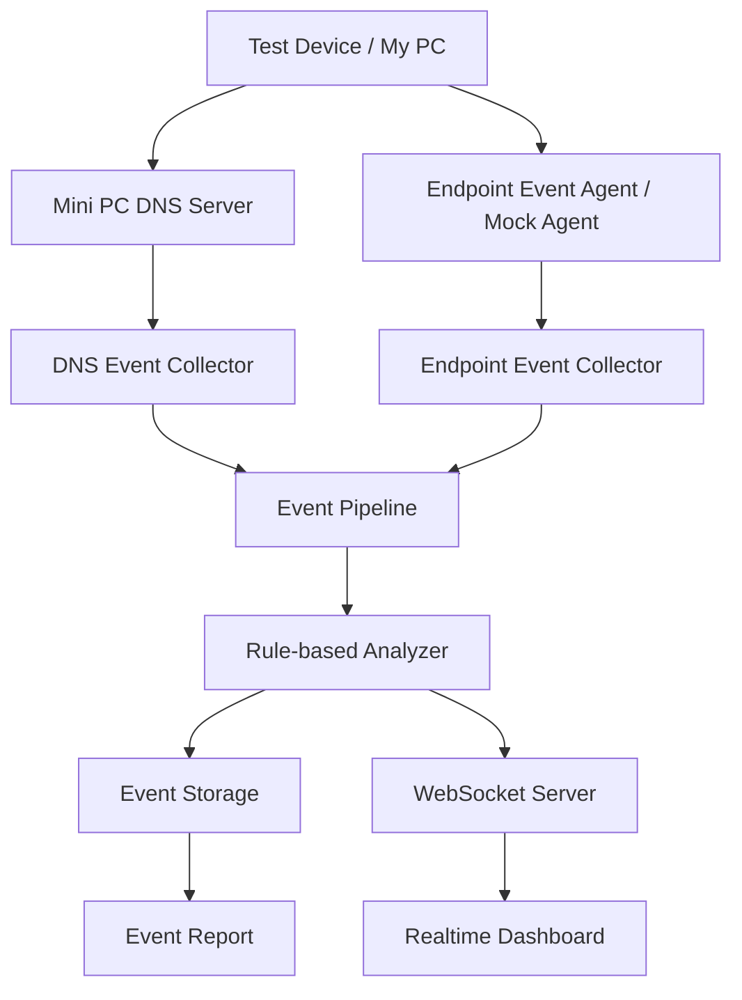

# OfficeGuard Lab

> 미니PC를 네트워크 관측 서버로 활용해 DNS, 네트워크 흐름, 단말 이벤트를 수집하고 보안 이벤트를 실시간으로 분석하는 학습용 프로젝트

## 개요

**OfficeGuard Lab**은 허가된 홈랩 환경에서 네트워크 메타데이터와 단말 이벤트를 수집하고, 이를 실시간으로 분석해 보안 관점의 이상 행위를 탐지하는 프로젝트다.

미니PC를 중심 서버로 사용하며, DNS 요청, 네트워크 flow, endpoint event를 공통 이벤트 모델로 정규화한 뒤 Apache Kafka 기반 파이프라인을 통해 처리한다. 이후 Rule 기반 분석 결과를 WebSocket으로 대시보드에 전달한다.

이 프로젝트는 실제 사용자 감시나 패킷 감청을 목표로 하지 않는다.

---

## 목표

* 미니PC 기반 네트워크 관측 서버 구성
* DNS query log 수집 및 정규화
* endpoint event mock 수집
* network flow event 모델 설계
* Apache Kafka 기반 이벤트 처리
* Rule 기반 이상 행위 탐지
* WebSocket 기반 실시간 대시보드 구현
* privacy-aware logging 구조 설계

---

## 수집 범위

### 수집하는 데이터

* DNS query metadata
* source IP
* destination IP
* destination port
* protocol
* event timestamp
* endpoint event metadata
* rule hit result

### 수집하지 않는 데이터

* 패킷 payload
* HTTPS 본문
* 계정 비밀번호
* 쿠키
* 인증 토큰
* 메신저 대화 내용
* 파일 본문
* 키보드 입력
* 화면 캡처

---

## 시스템 구조



---

## Kafka Pipeline

```text
Mock Event Generator
        │
        ▼
Kafka Producer
        │
        ▼
SecurityEvent Topic
        │
        ▼
Kafka Consumer
        │
        ▼
Rule-based Analyzer
        │
        ▼
Rule 조건 평가
        │
        ├─ 조건 불충족
        │      └─ 처리 종료
        │
        └─ 조건 충족
               │
               ▼
          RULE_HIT 생성
               │
               ▼
          Kafka Producer
               │
               ▼
      SecurityEvent Topic 재발행
```

### 애플리케이션 실행 순서

```text
환경 변수 검증
→ RuleBasedAnalyzer 인스턴스 생성
→ Kafka Topic 확인
→ Producer 연결
→ Consumer 연결
→ Consumer Handler 등록
→ Express 서버 실행
→ Mock Event Generator 실행
```

### 이벤트 처리 순서
```text
SecurityEvent 수신
→ Analyzer Rule 평가
→ RuleHitEvent 배열 반환
→ Rule Hit 로그 출력
→ 기존 Kafka Topic 재발행
→ Consumer가 RULE_HIT 수신
→ Analyzer가 RULE_HIT 제외
```

---

## 주요 기능

### DNS 관측

* DNS query log 수집
* 내부 IP별 요청량 집계
* 도메인별 요청량 집계
* 허용/차단 이벤트 기록

### Network Flow Event

* source IP / destination IP 기반 흐름 모델링
* destination port, protocol 기록
* bytes in/out 기반 트래픽 이벤트 정의

### Endpoint Event

초기 단계에서는 Mock Event Generator로 테스트 이벤트를 생성한다.

* 정상 DNS Query
* USB 저장 장치 연결
* USB 저장 장치로 파일 복사
* 파일 복사 후 외부 전송 역할의 테스트 도메인 DNS Query

Mock 이벤트는 일정 주기로 순차 생성되며, 이벤트마다 새로운 UUID와 timestamp를 사용한다.

```text
DNS_QUERY
→ USB_CONNECTED
→ FILE_COPIED
→ DNS_QUERY
→ 반복
```

### Rule-based Analyzer

수집된 `SecurityEvent`를 사전에 정의한 조건으로 분석해 이상 행위 가능성을 탐지한다.

단일 이벤트, 연속 이벤트, 시간 범위 집계 조건을 평가하며, 조건을 만족하면 원본 이벤트와 별도의 `RULE_HIT` 이벤트를 생성해 Kafka Topic에 다시 발행한다.

`RULE_HIT`은 보안 사고 확정이 아니라 탐지 조건에 해당하는 이벤트가 관측되었음을 의미한다.

* 대용량 파일 복사 탐지
* USB 연결 후 파일 복사 탐지
* 파일 복사 후 외부 전송 대상 도메인 DNS 조회 탐지
* DNS 요청량 급증 탐지

### Realtime Dashboard

* 실시간 이벤트 타임라인
* DNS 요청 현황
* 도메인 TOP 10
* 이벤트 타입별 카운트
* Rule Hit 목록
* 위험도별 이벤트 표시

---

## 이벤트 모델

모든 이벤트는 공통 필드와 이벤트별 `metadata`를 가진다.

### 이벤트 예시

```json
{
  "eventId": "evt_001",
  "eventType": "DNS_QUERY",
  "timestamp": "2026-06-19T12:30:00.000+09:00",
  "sourceIp": "192.168.0.12",
  "severity": "LOW",
  "message": "DNS query allowed",
  "metadata": {
    "domain": "github.com",
    "queryType": "A",
    "action": "ALLOW",
    "responseCode": "NOERROR"
  }
}
```

```json
{
  "eventId": "rule-hit-event-id",
  "eventType": "RULE_HIT",
  "timestamp": "2026-06-24T00:00:00.000Z",
  "sourceIp": "192.168.0.12",
  "deviceId": "test-laptop-01",
  "userAlias": "user-001",
  "severity": "HIGH",
  "message": "USB 연결 후 설정된 시간 범위 안에 파일 복사가 발생했습니다.",
  "metadata": {
    "ruleId": "USB_FILE_COPY_DETECTED",
    "relatedEventIds": [
      "usb-connected-event-id",
      "file-copied-event-id"
    ],
    "windowSeconds": 30
  }
}
```

### 이벤트 타입

```text
DNS_QUERY
NETWORK_FLOW
PROCESS_START
FILE_CREATED
FILE_MODIFIED
FILE_DELETED
FILE_COPIED
USB_CONNECTED
USB_DISCONNECTED
PRINT_REQUESTED
EMAIL_ATTACHMENT_SENT
RULE_HIT
```

---

## 기술 스택

### Backend

* Node.js
* TypeScript
* Express
* WebSocket

### Event Pipeline

* Apache Kafka
* KafkaJS
* KRaft

### Storage

* PostgreSQL
* SQLite

### Infra

* Docker
* Docker Compose
* Mini PC
* WSL2 Ubuntu

### Dashboard

* React
* Chart.js
* WebSocket

---

## 환경 변수

로컬 실행과 Docker Compose 실행에 `infra/.env` 파일을 사용한다.

| 환경 변수                         | 역할                       |
| ----------------------------- | ------------------------ |
| `NODE_ENV`                    | 애플리케이션 실행 환경             |
| `PORT`                        | Express 서버 포트            |
| `MOCK_EVENT_INTERVAL_MS`      | Mock 이벤트 생성 주기           |
| `KAFKA_CLIENT_ID`             | Kafka Client 식별자         |
| `KAFKA_BROKERS`               | 로컬 Backend용 Kafka 주소     |
| `KAFKA_DOCKER_BROKERS`        | Docker Backend용 Kafka 주소 |
| `KAFKA_SECURITY_EVENTS_TOPIC` | SecurityEvent Topic      |
| `KAFKA_CONSUMER_GROUP_ID`     | Consumer Group 식별자       |
| `ANALYZER_LARGE_FILE_COPY_BYTES_THRESHOLD` | 대용량 파일 복사 탐지 기준 byte 수 |
| `ANALYZER_USB_FILE_COPY_WINDOW_SECONDS` | USB 연결 후 파일 복사 탐지 시간 |
| `ANALYZER_FILE_COPY_EXTERNAL_DOMAIN_WINDOW_SECONDS` | 파일 복사 후 외부 도메인 조회 탐지 시간 |
| `ANALYZER_DNS_SPIKE_WINDOW_SECONDS` | DNS 요청량 집계 시간 |
| `ANALYZER_DNS_SPIKE_THRESHOLD` | DNS 요청량 급증 탐지 기준 |
| `ANALYZER_EXTERNAL_DOMAINS` | 외부 전송 대상 도메인 목록 |

환경 변수는 모두 필수이며 코드 내부 기본값을 사용하지 않는다.

실제 환경 변수 값은 README에 작성하지 않고 `infra/.env.example`에서 변수 항목만 관리한다.


---

## 실행 방법

### 로컬 실행

```powershell
cd backend

pnpm install
pnpm typecheck
pnpm dev
```

#### Health Check

```powershell
Invoke-RestMethod http://localhost:4000/health
```

### 빌드 실행

```powershell
cd backend

pnpm build
pnpm start
```

### Docker Compose 실행

#### 프로젝트 루트에서 실행

```powershell
Copy-Item .\infra\.env.example .\infra\.env

docker compose --env-file .\infra\.env -f .\infra\docker-compose.yml up --build -d
docker compose --env-file .\infra\.env -f .\infra\docker-compose.yml ps
```

#### Health Check

```powershell
Invoke-RestMethod http://localhost:4000/health
```

#### Backend 로그 확인:
```powershell
docker compose --env-file .\infra\.env  -f .\infra\docker-compose.yml logs -f backend
```

#### 종료

```powershell
docker compose --env-file .\infra\.env -f .\infra\docker-compose.yml down
```

---

## 진행 단계

### Phase 1. 프로젝트 초기 구성 ✅ 완료

* Node.js + TypeScript 프로젝트 구성
* pnpm 기반 패키지 관리
* Express 서버 구성
* 환경 변수 분리
* Docker Compose 구성
* Health Check API 구현

### Phase 2. 이벤트 모델 정의 ✅ 완료

* 공통 `SecurityEvent` 타입 정의
* `DNS_QUERY` 이벤트 정의
* `NETWORK_FLOW` 이벤트 정의
* `USB_CONNECTED` 이벤트 정의
* `FILE_COPIED` 이벤트 정의
* `RULE_HIT` 이벤트 정의
* 이벤트별 metadata 타입 분리

### Phase 3. Mock Event Generator ✅ 완료

* 정상 DNS Query Mock 이벤트 생성
* USB 연결 Mock 이벤트 생성
* 파일 복사 Mock 이벤트 생성
* 외부 전송 대상 도메인 DNS Query 생성
* UUID 및 ISO 8601 timestamp 생성
* 환경 변수 기반 생성 주기 설정
* Mock 이벤트 순차 반복
* 정상 및 의심 이벤트 콘솔 출력
* Mock Generator의 `RULE_HIT` 직접 생성 제외

### Phase 4. Event Pipeline ✅ 완료

* Kafka 단일 KRaft 브로커 구성
* SecurityEvent Topic 구성
* Kafka Producer 구현
* Kafka Consumer 구현
* Topic 생성 또는 존재 여부 확인
* Mock 이벤트 Kafka 발행
* Consumer 이벤트 수신 및 로그 출력
* Producer와 Consumer의 `eventId` 일치 확인
* 로컬 및 Docker Compose 실행 검증

### Phase 5. Rule-based Analyzer ✅ 완료

* Analyzer 환경 설정 분리
* 탐지 Rule과 Severity 정의
* 대용량 파일 복사 탐지
* USB 연결 후 파일 복사 탐지
* 파일 복사 후 외부 전송 대상 도메인 DNS 조회 탐지
* 동일한 `sourceIp`의 DNS 요청량 급증 탐지
* 이벤트 발생 시각 기반 시간 범위 분석
* 동일한 `deviceId` 또는 `sourceIp` 기준 이벤트 연결
* Analyzer 상태 메모리 저장 및 만료 처리
* `RULE_HIT` 이벤트 생성
* 탐지 근거 이벤트 ID 기록
* 기존 SecurityEvent Topic 재발행
* `RULE_HIT` 재분석 방지
* DNS Spike 반복 탐지 제한

### Phase 6. Storage

* 이벤트 저장 구조 설계
* `SecurityEvent` 저장
* `RULE_HIT` 저장
* 최근 이벤트 조회
* 시간 범위 조회
* `sourceIp` 또는 `deviceId` 기준 필터링

### Phase 7. Realtime Dashboard

* WebSocket 서버 구성
* SecurityEvent 실시간 전달
* Rule Hit 실시간 전달
* 이벤트 타임라인 표시
* DNS 요청 현황 표시
* Rule Hit 목록 표시
* WebSocket 연결 상태 표시

### Phase 8. Mini PC DNS 연동

* 미니PC DNS 관측 도구 구성
* DNS Query Log 수집 방식 확인
* DNS Event Collector 구현
* 실제 DNS 로그를 `DNS_QUERY` 이벤트로 변환
* Event Pipeline 발행
* Dashboard 표시

### Phase 9. 문서화 / 시연

* README 정리
* 시스템 구조 문서화
* 이벤트 처리 흐름 문서화
* 이벤트 모델 문서화
* Rule-based Analyzer 문서화
* 보안 및 Privacy Boundary 명시
* 실행 방법 정리
* 시연 시나리오 작성
* 실행 화면 및 로그 추가


---

## 보안 및 프라이버시 원칙

이 프로젝트는 보안 관측 구조를 학습하기 위한 실험 프로젝트다.

* 허가된 홈랩 환경에서만 사용
* 타인 네트워크 및 실제 회사망 대상 사용 금지
* 패킷 payload 및 파일 본문 저장 금지
* 계정 정보, 쿠키, 토큰 수집 금지
* 사용자 실명 대신 익명화된 별칭 사용
* 실제 USB 시리얼 번호 저장 금지
* 로컬 환경 변수와 런타임 데이터 Git 제외

---

## 디렉토리 구조

```text
officeguard-lab/
 ├─ backend/
 │   ├─ src/
 │   │   ├─ config/
 │   │   ├─ events/
 │   │   ├─ mock/
 │   │   ├─ torage/
 │   │   ├─ websocket/
 │   │   └─ index.ts
 │   ├─ .dockerignore
 │   ├─ Dockerfile
 │   ├─ package.json
 │   ├─ pnpm-lock.yaml
 │   └─ tsconfig.json
 │
 ├─ dashboard/
 │   └─ src/
 │
 ├─ agent/
 │   └─ mock/
 │
 ├─ infra/
 │   ├─ .env.example
 │   └─ docker-compose.yml
 │
 ├─ docs/
 │   ├─ architecture.md
 │   ├─ event-model.md
 │   ├─ rules.md
 │   └─ privacy.md
 │
 ├─ .gitignore
 └─ README.md
```

---

## Git Workflow

이 프로젝트는 기능 단위 브랜치와 PR 기반으로 변경 사항을 관리한다.

```bash
git checkout -b feature/xxx
git add .
git commit -m "feat: xxx"
git push origin feature/xxx
```

### 기준

* `main` 브랜치는 실행 가능한 상태로 유지한다.
* 기능 추가, 구조 변경, 문서 수정은 별도 브랜치에서 진행한다.
* PR 체크리스트 기반으로 변경 범위를 검증한다.
* 런타임 파일, 로그 파일, 로컬 설정 파일은 Git에 포함하지 않는다.
* 민감 정보, 토큰, 인증 정보, 개인 데이터는 저장소에 포함하지 않는다.

---