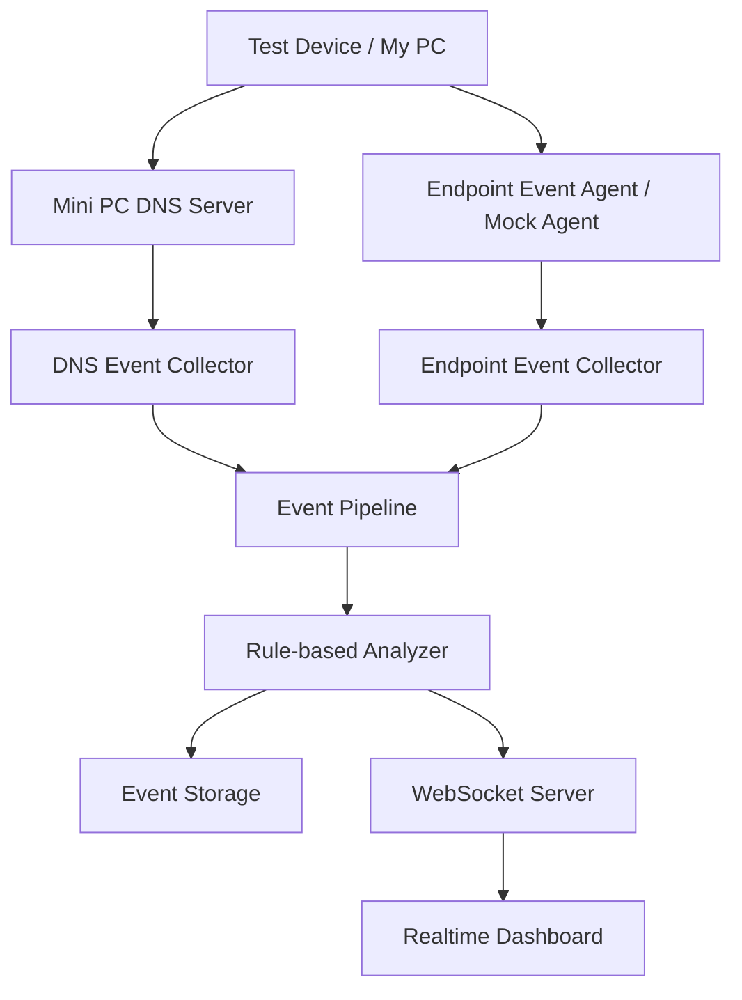

# OfficeGuard Lab

> 미니PC를 네트워크 관측 서버로 활용해 DNS, 네트워크 흐름, 단말 이벤트를 수집하고 보안 이벤트를 실시간으로 분석하는 학습용 프로젝트

## 개요

**OfficeGuard Lab**은 허가된 홈랩 환경에서 네트워크 메타데이터와 단말 이벤트를 수집하고, 이를 실시간으로 분석해 보안 관점의 이상 행위를 탐지하는 프로젝트다.

미니PC를 중심 서버로 사용하며, DNS 요청, 네트워크 flow, endpoint event를 공통 이벤트 모델로 정규화한 뒤 Kafka 또는 Redis Stream 기반 파이프라인을 통해 처리한다. 이후 Rule 기반 분석 결과를 WebSocket으로 대시보드에 전달한다.

이 프로젝트는 실제 사용자 감시나 패킷 감청을 목표로 하지 않는다.

---

## 목표

* 미니PC 기반 네트워크 관측 서버 구성
* DNS query log 수집 및 정규화
* endpoint event mock 수집
* network flow event 모델 설계
* Kafka 또는 Redis Stream 기반 이벤트 처리
* Rule 기반 이상 행위 탐지
* WebSocket 기반 실시간 대시보드 구현
* privacy-aware logging 구조 설계

---

## 수집 범위

### 수집하는 데이터

* DNS query metadata
* source IP
* destination IP
* destination port
* protocol
* event timestamp
* endpoint event metadata
* rule hit result

### 수집하지 않는 데이터

* 패킷 payload
* HTTPS 본문
* 계정 비밀번호
* 쿠키
* 인증 토큰
* 메신저 대화 내용
* 파일 본문
* 키보드 입력
* 화면 캡처

---

## 시스템 구조



---

## 주요 기능

### DNS 관측

* DNS query log 수집
* 내부 IP별 요청량 집계
* 도메인별 요청량 집계
* 허용/차단 이벤트 기록

### Network Flow Event

* source IP / destination IP 기반 흐름 모델링
* destination port, protocol 기록
* bytes in/out 기반 트래픽 이벤트 정의

### Endpoint Event

초기 단계에서는 mock event로 구현한다.

* 프로세스 실행
* 파일 생성/수정/삭제
* 파일 복사
* USB 연결
* 프린트 요청
* 외부 전송 의심 이벤트

### Rule-based Detection

* USB 연결 후 파일 복사 탐지
* 파일 복사 후 외부 도메인 접속 탐지
* DNS 요청량 급증 탐지
* 짧은 시간 내 다수 외부 도메인 접속 탐지
* 대량 outbound traffic 탐지

### Realtime Dashboard

* 실시간 이벤트 타임라인
* DNS 요청 현황
* 도메인 TOP 10
* 이벤트 타입별 카운트
* Rule Hit 목록
* 위험도별 이벤트 표시

---

## 이벤트 예시

```json
{
  "eventId": "evt_001",
  "eventType": "DNS_QUERY",
  "timestamp": "2026-06-19T12:30:00.000+09:00",
  "sourceIp": "192.168.0.12",
  "severity": "LOW",
  "message": "DNS query allowed",
  "metadata": {
    "domain": "github.com",
    "queryType": "A",
    "action": "ALLOW",
    "responseCode": "NOERROR"
  }
}
```

```json
{
  "eventId": "evt_002",
  "eventType": "RULE_HIT",
  "timestamp": "2026-06-19T12:40:00.000+09:00",
  "sourceIp": "192.168.0.12",
  "severity": "HIGH",
  "message": "USB 연결 후 파일 복사와 외부 도메인 접속이 연속 발생했습니다.",
  "metadata": {
    "ruleId": "USB_FILE_EXFILTRATION_SUSPECTED"
  }
}
```

---

## 기술 스택

### Backend

* Node.js
* TypeScript
* Express
* WebSocket

### Event Pipeline

* Kafka
* Redis Stream

### Storage

* PostgreSQL
* SQLite

### Infra

* Docker
* Docker Compose
* Mini PC
* WSL2 Ubuntu

### Dashboard

* React
* Chart.js
* WebSocket

---

## 진행 단계

### Phase 1. 프로젝트 초기 구성

* Node.js + TypeScript 프로젝트 구성
* pnpm 기반 패키지 관리
* Docker Compose 구성
* 기본 서버 및 health check API 구현

### Phase 2. 이벤트 모델 정의

* 공통 SecurityEvent 타입 정의
* DNS event 정의
* Network flow event 정의
* Endpoint event 정의
* Rule hit event 정의

### Phase 3. Mock Event Generator

* DNS query mock event 생성
* USB 연결 mock event 생성
* 파일 복사 mock event 생성
* 외부 도메인 접속 mock event 생성

### Phase 4. Event Pipeline

* Kafka 또는 Redis Stream 구성
* Producer 구현
* Consumer 구현
* 이벤트 publish/consume 검증

### Phase 5. Rule-based Analyzer

* 단일 이벤트 기반 탐지
* 연속 이벤트 기반 탐지
* Rule hit event 생성

### Phase 6. Storage

* 이벤트 저장
* 최근 이벤트 조회
* Rule hit 조회
* IP 또는 deviceId 기준 필터링

### Phase 7. Realtime Dashboard

* WebSocket 실시간 이벤트 전달
* 이벤트 타임라인 표시
* DNS 요청 현황 표시
* Rule hit 목록 표시

### Phase 8. Mini PC DNS 연동

* 미니PC DNS 관측 도구 구성
* DNS query log 수집
* 실제 DNS event 변환
* 대시보드 표시

### Phase 9. 문서화 / 시연

* README 정리
* 아키텍처 문서화
* 이벤트 모델 문서화
* privacy boundary 명시
* 시연 시나리오 작성

---

## 보안 및 프라이버시 원칙

이 프로젝트는 보안 관측 구조를 학습하기 위한 실험 프로젝트다.

* 허가된 홈랩 환경에서만 사용한다.
* 실제 회사망이나 타인 네트워크를 대상으로 사용하지 않는다.
* 패킷 payload를 저장하지 않는다.
* 개인 계정 정보, 쿠키, 토큰을 수집하지 않는다.
* 개인 파일 본문을 수집하지 않는다.
* 사용자 실명 기반 감시 기능을 만들지 않는다.
* 내부 IP 익명화 옵션을 제공한다.
* 이벤트 보관 기간을 설정할 수 있도록 한다.

---

## 예상 디렉터리 구조

```text
officeguard-lab/
 ├─ backend/
 │   └─ src/
 │       ├─ config/
 │       ├─ events/
 │       ├─ collectors/
 │       ├─ pipeline/
 │       ├─ analyzer/
 │       ├─ storage/
 │       ├─ websocket/
 │       └─ index.ts
 │
 ├─ dashboard/
 │   └─ src/
 │
 ├─ agent/
 │   └─ mock/
 │
 ├─ infra/
 │   └─ docker-compose.yml
 │
 ├─ docs/
 │   ├─ architecture.md
 │   ├─ event-model.md
 │   ├─ rules.md
 │   └─ privacy.md
 │
 └─ README.md
```

---

## Git Workflow

이 프로젝트는 기능 단위 브랜치와 PR 기반으로 변경 사항을 관리한다.

```bash
git checkout -b feature/xxx
git add .
git commit -m "feat: xxx"
git push origin feature/xxx
```

### 기준

* `main` 브랜치는 실행 가능한 상태로 유지한다.
* 기능 추가, 구조 변경, 문서 수정은 별도 브랜치에서 진행한다.
* PR 체크리스트 기반으로 변경 범위를 검증한다.
* 런타임 파일, 로그 파일, 로컬 설정 파일은 Git에 포함하지 않는다.
* 민감 정보, 토큰, 인증 정보, 개인 데이터는 저장소에 포함하지 않는다.

---