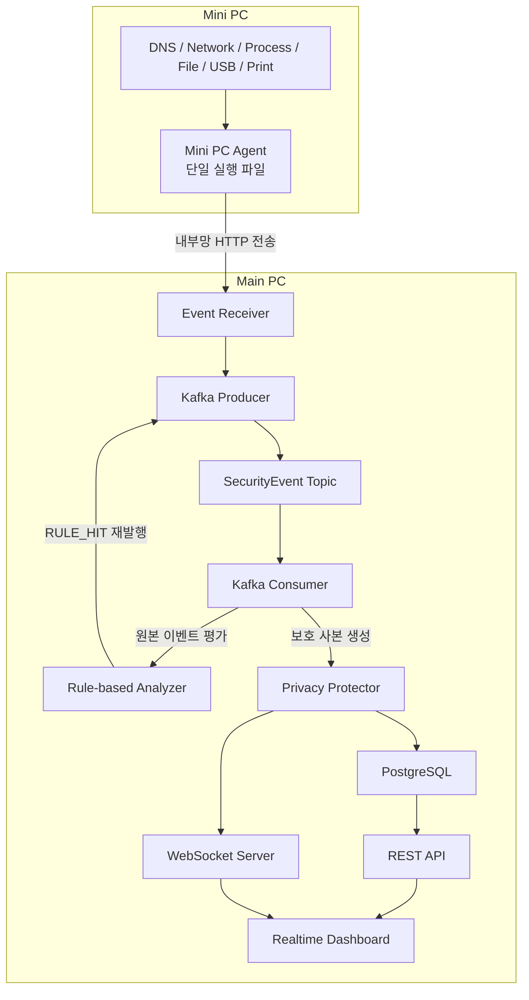

# 시스템 구조

## 1. 개요

OfficeGuard Lab의 Main PC와 Mini PC 역할, 전체 이벤트 처리 흐름, 내부망 전송 경계 정리

---

## 2. 전체 구조



---

## 3. Kafka Pipeline

```text
Mini PC Agent
        │
        ▼
Main PC Event Receiver
        │
        ├─ 수신 데이터 검증 실패
        │      └─ HTTP 400 응답 및 처리 종료
        │
        └─ 수신 데이터 검증 성공
               │
               ▼
          Kafka Producer
               │
               ▼
       SecurityEvent Topic
               │
               ▼
         Kafka Consumer
               │
               ├─ 보호 사본 생성
               │      ├─ Source IP 익명화
               │      └─ 민감 도메인 마스킹
               │             ├─ PostgreSQL 저장
               │             └─ WebSocket 실시간 전달
               │                    └─ Realtime Dashboard
               │
               └─ 원본 이벤트 Rule-based Analyzer 평가
                      │
                      ├─ 조건 불충족
                      │      └─ 분석 종료
                      │
                      └─ 조건 충족
                             │
                             ▼
                        RULE_HIT 생성
                             │
                             ▼
                        Kafka Producer
                             │
                             ▼
                    SecurityEvent Topic 재발행
                             │
                             ▼
                      Consumer 재수신
                             │
                             ├─ 보호 설정 적용
                             ├─ PostgreSQL 저장
                             ├─ WebSocket 실시간 전달
                             └─ Analyzer 재분석 제외
```

---

## 4. Backend 실행 순서

```text
환경 변수 및 Privacy 설정 검증
→ RuleBasedAnalyzer 인스턴스 생성
→ Express 애플리케이션 및 조회 API 구성
→ HTTP 서버와 WebSocket Endpoint 구성
→ PostgreSQL 연결 확인
→ 보관 기간 초과 이벤트 즉시 정리
→ 반복 정리 Timer 등록
→ Kafka Topic 확인
→ Producer 및 Consumer 연결
→ HTTP 및 WebSocket 서버 실행
```

---

## 5. Main PC와 Mini PC 역할

| 구분      | 역할    |
| ------- | ------ |
| Main PC | 이벤트 수신·검증, Kafka 처리, Rule 분석, Privacy 처리, 저장, 조회, 실시간 전달, Dashboard 실행 |
| Mini PC | 실제 이벤트 수집, `SecurityEvent` 정규화, 내부망 전송  |

### Main PC 구성

```text
Main PC
├─ Event Receiver
├─ Kafka Producer
├─ Kafka Consumer
├─ Rule-based Analyzer
├─ Privacy Protector
├─ PostgreSQL Storage
├─ REST API
├─ WebSocket Server
└─ Realtime Dashboard
```

### Mini PC 구성

```text
Mini PC
├─ Mini PC Agent 단일 실행 파일
├─ DNS Collector
├─ Network Flow Collector
├─ Process Collector
├─ File Collector
├─ USB Collector
├─ Print Collector
├─ SecurityEvent 정규화
└─ Main PC Event Receiver 전송
```

---

## 6. 원본 이벤트와 보호 사본

### 원본 이벤트

```text
Kafka Consumer
→ Rule-based Analyzer
→ Rule 조건 평가
→ 조건 충족 시 RULE_HIT 생성
```

* Source IP 익명화 전 데이터 사용
* 도메인 마스킹 전 데이터 사용
* 원본 이벤트 객체 변경 제외

### 보호 사본

```text
Kafka Consumer
→ Privacy Protector
├─ PostgreSQL 저장
└─ WebSocket 전달
```

* Source IP 익명화
* 민감 도메인 마스킹
* `eventId` 및 이벤트 연결 관계 유지

---

## 7. 내부망 전송 경계

```text
Mini PC Agent
→ POST http://<MAIN_PC_IP>:4000/api/agent/events
→ Main PC Event Receiver
```

### Agent 환경 변수

```text
AGENT_RECEIVER_URL=http://<MAIN_PC_IP>:4000/api/agent/events
```

### 전송 기준

* Main PC 내부 IPv4 사용
* Agent Event만 Main PC로 전송
* 코드 내 Main PC IP 고정 제외
* 외부 클라우드 서버 전송 제외

---

## 8. 네트워크 경계

```text
Mini PC 일반 인터넷 통신
→ 기존 공유기 및 인터넷 연결

Mini PC Agent Event
→ 내부망
→ Main PC Event Receiver
```

* Mini PC 트래픽의 Main PC 강제 우회 제외
* Main PC DNS 서버 구성 제외
* 공유기 DNS 설정 변경 제외
* 패킷 Payload 전송 제외
* HTTP 및 HTTPS 본문 전송 제외

---

## 9. 컴포넌트 책임

| 컴포넌트                | 역할                        |
| ------------------- | ------------------------- |
| Mini PC Agent       | 이벤트 수집, 정규화, 내부망 전송       |
| Event Receiver      | HTTP 수신, 구조 검증, Kafka 발행  |
| Kafka Producer      | SecurityEvent Topic 발행    |
| Kafka Consumer      | 이벤트 수신 및 후속 처리 연결         |
| Rule-based Analyzer | 원본 이벤트 평가 및 `RULE_HIT` 생성 |
| Privacy Protector   | Source IP 익명화 및 도메인 마스킹   |
| PostgreSQL          | 이벤트 및 Rule Hit 저장         |
| REST API            | 저장 이벤트 조회                 |
| WebSocket Server    | 신규 이벤트 실시간 전달             |
| Realtime Dashboard  | 최근 및 신규 이벤트 시각화           |

---

## 10. 제외 범위

* Mini PC 트래픽의 Main PC 강제 경유
* Main PC DNS 서버 구성
* 외부 클라우드 Event 전송
* 패킷 Payload 저장
* HTTPS 본문 복호화
* Agent 설치 프로그램
* Windows Service 등록
* Agent 자동 시작 및 은닉 실행
* Agent 제거 방지
* Kernel Driver
* File System Minifilter
